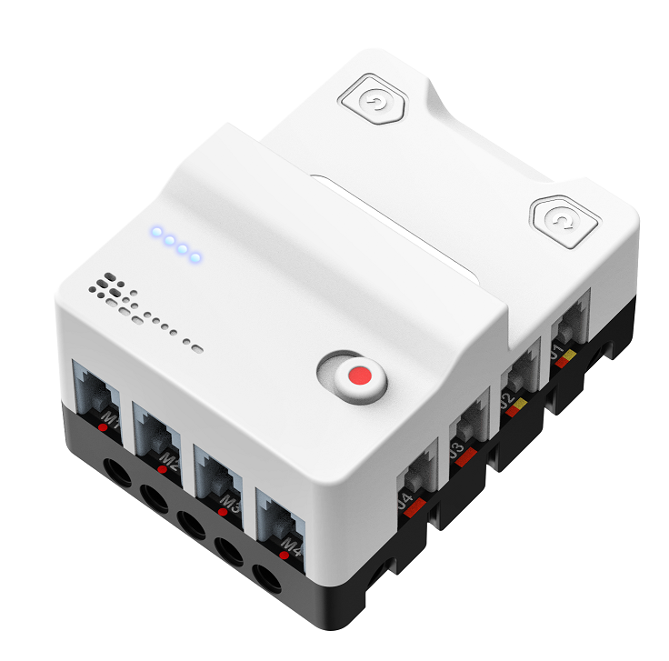

> Diese Seite bei [https://mpoelzl.github.io/pxt-mintspark-nezhav2/](https://mpoelzl.github.io/pxt-mintspark-nezhav2/) öffnen

## NeZha V2

The NeZha V2 Expansion Pack is tailored for the micro:bit, aimed at stimulating students' innovative thinking and practical skills. This guide facilitates programming and control of the NeZha V2 Expansion Board, enabling functions such as motor control and sensor integration. To purchase the NeZha V2, visit the [Elecfreaks Official Store](https://shop.elecfreaks.com/products/nezha-breakout-board-v2).

### Installing this Extension

1. Launch MakeCode editor and click the "Extensions" icon.
2. Search for "NeZha V2" or paste the link "[https://github.com/mpoelzl/pxt-mintspark-nezhav2/](https://github.com/mpoelzl/pxt-mintspark-nezhav2/)" to download and install the extension.

## Instructions

For detailed examples and instructions, visit the Elecfreaks Wiki [online tutorials](https://wiki.elecfreaks.com/en/microbit/expansion-board/nezha-v2/).

## Supported Targets

- PXT/micro:bit

## License

This extension is licensed under the MIT License.

#### Metadaten (verwendet für Suche, Rendering)

* for PXT/microbit

